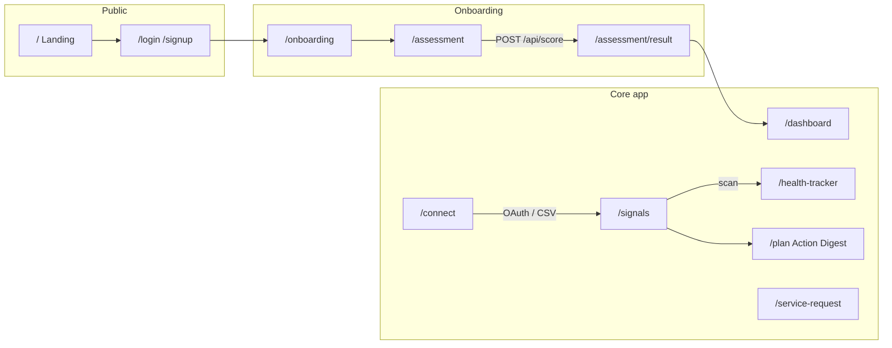
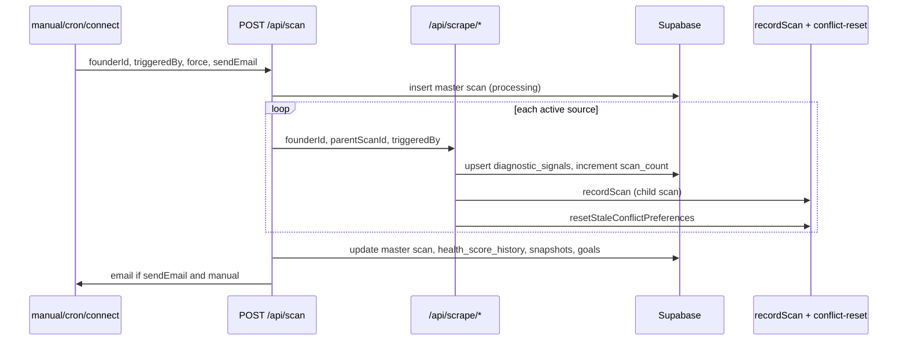

# Elvanis — Project Context

> **Purpose:** Single reference for business decisions, product rules, feature boundaries, and how pages, UI, API routes, cron jobs, and `lib/` modules relate.  
> **Audience:** Engineers, AI agents, and product stakeholders working in this repo.  
> **Last aligned with codebase:** May 2026.

---

## 1. Product summary

**Elvanis** is an AI business health platform for founder-led startups and SMEs (UK + Gulf). It:

1. **Collects data** — 25-question assessment and/or connected tools (GA4, Jira, Shopify, Intercom, Trustpilot, CSV).
2. **Diagnoses** — Produces `diagnostic_signals` (typed, severity-ranked issues) and an optional **assessment score** (six dimensions).
3. **Prioritises** — Health score, signal cascades, conflict detection, and (Navigator) **Action Digest** (90-day AI plan).
4. **Tracks impact** — Goals tied to signal metrics; scan-over-scan trends on **Business Health Tracker**.
5. **Monetises** — Navigator subscription (£29/mo) + one-off services (roadmap £99, CPO £250, workshop £500).

**Tagline:** *Know what to fix before you scale.*

---

## 2. Subscription tiers & business rules

| Tier | DB value | Price | Key capabilities |
|------|----------|-------|------------------|
| **Free** | `free` | £0 | Monthly auto-scan cadence for all sources; max **3 effective connections** (live integrations + CSV counts as 1); **no manual scan**; Action Digest gated; Jira/Intercom treated as **30-day** cadence (not 7-day) |
| **Navigator** | `navigator` | £29/mo | Weekly Jira/Intercom scans; monthly GA4/Shopify/Trustpilot; **manual scan** (7-day cooldown on button); Action Digest; unlimited connections; Jira ticket from signal |
| **Advisor** | `advisor` | (types only) | Declared in `lib/types.ts`; not fully wired in UI |
| **Deactivated** | `deactivated` | — | Set from profile; account wind-down |

**Trial:** `founders.trial_ends_at` — full Navigator-style access until expiry if tier is still `free`.

**Stripe:** Checkout via `NEXT_PUBLIC_STRIPE_PAYMENT_LINK` and per-service links on `/service-request`.

### Free vs Navigator — enforced in code

| Rule | Where |
|------|--------|
| Max 3 sources (CSV = 1 slot) | `app/connect/page.tsx` → `isAtLimit` |
| Manual scan blocked | `app/signals/scan-button.tsx` → upgrade modal |
| Weekly Jira/Intercom only for Navigator | `app/api/scan/route.ts` → skip with note |
| Action Digest UI gated | `app/plan/page.tsx` |
| Digest cron Navigator-only | `app/api/cron/digest/route.ts` |

**Marketing copy note:** Landing page (`app/page.tsx`) says “Connect 1 tool” for Free; **implementation uses 3 effective slots** — treat connect page as source of truth until copy is aligned.

---

## 3. Founder journey (high level)



**Middleware** (`app/middleware.ts`): Protected routes require auth + `founders.onboarding_completed`. Public: `/`, auth pages, `/api/*`.

**Onboarding** (`app/onboarding/page.tsx`): Stage (`early_stage` | `product_customers`), industry, market, brand URL, focus metric → writes `founders` row.

---

## 4. Pages → purpose → data → APIs

| Route | UI role | Primary reads | Primary writes / triggers |
|-------|---------|---------------|---------------------------|
| `/` | Marketing; EN/AR; Free vs Navigator comparison | — | Links to signup, connect |
| `/login`, `/signup`, `/forgot-password`, `/reset-password` | Supabase auth | — | `app/(auth)/actions.ts`, callback |
| `/onboarding` | Profile + stage + focus | `founders` | `founders` update |
| `/assessment` | 25-question wizard (client) | `founders` | → `POST /api/score` |
| `/assessment/result` | Score breakdown, roadmap | `scores`, `assessments` | — |
| `/dashboard` | Command centre: health score, top signals, goals, AI readiness, digest teaser | signals, scores, goals, sources, digests | Links only |
| `/signals` | Signal feed, filters, conflicts, scan button | `diagnostic_signals`, `conflict_resolutions` | Scan, acknowledge, resolve, dismiss, feedback, Jira |
| `/health-tracker` | Impact tracking: trends, scan history, goals | `scans`, `health_score_history`, signals, goals | Goals via API |
| `/plan` | **Action Digest** (90-day plan, 3 phases) | `action_digests` | Navigator only; digest from cron/API |
| `/connect` | Integrations hub | `data_sources` | OAuth routes, CSV upload |
| `/connect/ga/select`, `/connect/jira/select`, etc. | Post-OAuth property/project selection | `data_sources` | Select-property APIs |
| `/connect/csv`, `/connect/shopify`, `/connect/trustpilot`, `/connect/intercom` | Source-specific connect UX | — | Upload / domain entry |
| `/profile` | Account, tier, language, deactivate | `founders` | Profile client |
| `/service-request` | Paid services + Navigator upgrade | `founders` | `POST /api/service-request` |

**Legacy URL:** Emails and some routes still link to `/measure` — **replaced by `/health-tracker`** (no `app/measure` route).

**Nav** (`components/GlobalHeader.tsx`): Dashboard → Signals → Business Health Tracker → Action Digest → Connect → Request Service.

---

## 5. UI components

| Component | Used on | Responsibility |
|-----------|---------|----------------|
| `GlobalHeader` | All authenticated main pages | Nav + passes founder to `HeaderUser` |
| `HeaderUser` | Header dropdown | Profile, sign out |
| `ScanButton` | `/signals` | Manual scan (Navigator); 7-day cooldown; Free → upgrade modal |
| `ConnectedBanner` | `/signals` | Post-connect messaging |
| `AssessmentBanner` | `/signals`, dashboard | Prompt assessment when no tools |
| `ConflictTrustButton` | `/signals` | Save conflict resolution preference |
| `AssessmentClient` | `/assessment` | Multi-step assessment UI |
| `ProfileClient` | `/profile` | Editable founder fields |

**Design system:** Inline styles; primary blue `#2563EB`; Inter font; severity colors: critical `#DC2626`, warning `#D97706`, healthy `#059669`.

---

## 6. `lib/` modules — contracts & consumers

| Module | Role | Used by |
|--------|------|---------|
| `lib/types.ts` | TS types: `Founder`, `Assessment`, `Score`, `Goal`, `DimensionKey`, `DIMENSION_LABELS` | Pages, APIs |
| `lib/supabase.ts` | Browser Supabase client | Client components, auth pages |
| `lib/supabase-server.ts` | `createServerComponentClient()` (RLS session), `createAdminClient()` (service role) | Server pages, APIs |
| `lib/signal-analysis.ts` | `SIGNAL_DIRECTION`, `CSV_CONFIRMATION_SOURCES`, `analyseSignalConflicts()`, `calculatePriorityScore()`, `SIGNAL_CASCADES` | `/signals`, `/dashboard` |
| `lib/signal-goal-map.ts` | **`SIGNAL_GOAL_MAP`** — metric labels, units, lower/higher better, upsell service | Goals API, dashboard, scan goal check, health-tracker |
| `lib/scan-recorder.ts` | `recordScan()`, `determineTrend()` — scan row + snapshots; **does not** increment `scan_count` | All scrape routes, CSV upload |
| `lib/conflict-reset.ts` | `resetStaleConflictPreferences()` — delete resolutions when values move &gt;2× or &lt;0.5× | Scan + scrape routes |
| `lib/token-refresh.ts` | `getValidToken()` for ga4/jira/shopify/intercom | Scrape + Jira create |
| `lib/goal-checker.ts` | **Empty stub** — goal logic lives in `app/api/scan/route.ts` today |

### Critical lib rules (do not duplicate elsewhere)

1. **`SIGNAL_GOAL_MAP`** — Only place for signal → goal copy, units, `lowerBetter`, upsell URLs.
2. **`scan_count`** — Increment in each **scrape route** update block; `recordScan()` only writes `scans` + `signal_snapshots`.
3. **`triggeredBy`** on scans — Required: `'manual' | 'cron' | 'connect'`; no default in `recordScan`.
4. **Health score formula** — Must match everywhere:

```ts
// critical -15, warning -7, watch -2; start 100; clamp 0–100
// Exclude source === 'manual'
// Empty active signals → -1 (no score)
```

Defined in: `app/dashboard/page.tsx`, `app/api/scan/route.ts`, crons/emails.

---

## 7. Diagnostic signals — domain model

### Signal types (19)

`churn_spike`, `ticket_volume_increase`, `rating_decline`, `velocity_drop`, `conversion_fall`, `engagement_drop`, `refund_spike`, `response_time_increase`, `repeat_complaint_pattern`, `bug_backlog_growth`, `aov_decline`, `repeat_purchase_drop`, `activation_drop`, `traffic_source_shift`, `session_duration_drop`, `cycle_time_increase`, `blocked_tickets_spike`, `nps_decline`, `csat_decline`

### Sources

| `source` | Origin |
|----------|--------|
| `manual` | Assessment (`/api/score` → `generateAssessmentSignals`) |
| `ga4`, `jira`, `shopify`, `intercom`, `trustpilot` | Scrape routes |
| `csv` | `POST /api/csv/upload` |

### Severities

`critical` | `warning` | `watch`

### Status lifecycle

| Status | Meaning |
|--------|---------|
| `new` | Active, unread |
| `acknowledged` | Founder marked “working on it” |
| `resolved` | Fixed / archived (Historical Wins) |
| `dismissed` | Deprioritised |

**APIs:** `GET /api/signals/[id]/acknowledge`, `resolve`, `dismiss`, `feedback`, `create-jira`, `POST /api/signals/resolve-conflict`

### Trends (per scan)

`new` | `improving` | `worsening` | `unchanged` — from `determineTrend()` / scrape logic using `SIGNAL_DIRECTION`.

### Conflict & confirmation

- Same `signal_type` across sources → `analyseSignalConflicts()` adds `flags: confirmed | conflict`.
- Threshold: value “bad” if &gt;50 (lower_better) or &lt;50 (higher_better) when both sides have numeric values.
- CSV vs tool: only pairs in `CSV_CONFIRMATION_SOURCES`.
- Founder picks trusted source → `conflict_resolutions` table; stale prefs cleared by `conflict-reset` on material value change.

### Priority score (dashboard ordering)

```
(cascadeCount × 3) + severityWeight + confirmationBonus(5) - conflictPenalty(3)
```

`SIGNAL_CASCADES` defines downstream types per root signal.

---

## 8. Assessment & scoring

### Flow

1. `AssessmentClient` collects answers + optional real numbers (MRR, CAC, LTV, churn, NPS, MRR growth).
2. `POST /api/score` — Groq (`GROQ_API_KEY`) returns dimension JSON; **server** applies weight matrix and computes `overall_score`.

### Weight matrices (server-only)

- `early_stage` — PMF 30%, team 20%, …
- `product_customers` — revenue 25%, customer 20%, …

Stage comes from `founders.founder_stage` / onboarding.

### Assessment → signals

`generateAssessmentSignals()` in `app/api/score/route.ts`: rules for LTV&lt;CAC, churn&gt;5%, NPS&lt;30, runway, PMF reaction, team dependency, etc. All `source: 'manual'`.

### Six score dimensions (assessment)

Maps to `DimensionKey` in types: `revenue_financial`, `product_market_fit`, `team_operations`, `customer_retention`, `marketing_growth`, `strategy_goals`.

---

## 9. Goals (impact tracking)

- Table: `goals` — linked to `signal_type`, `target_value`, `target_date`, `current_value`, `status`.
- Create: `POST /api/goals` — validates against `SIGNAL_GOAL_MAP`; one active goal per signal type.
- Status helpers: `getGoalStatus()`, `getGoalProgress()` in `signal-goal-map.ts`.
- **After every scan:** `app/api/scan/route.ts` updates `current_value`, sets `achieved` or `missed`, emails founder.
- UI: dashboard goal cards; **Business Health Tracker** (`/health-tracker`) goals section.
- Upsell on failing goals: `service: 'roadmap' | 'cpo'` from map → `/service-request?type=...`

---

## 10. Scan pipeline



### Scan cadence

| Source type | Navigator | Free |
|-------------|-----------|------|
| `jira`, `intercom` | 7 days | 30 days (weekly skipped in scan route) |
| `ga4`, `shopify`, `trustpilot` | 30 days | 30 days |
| `csv` | Upload only — never auto-scanned | Same |

### `triggeredBy` semantics

| Value | Typical caller |
|-------|----------------|
| `manual` | Scan button (`sendEmail: true`) |
| `cron` | `auto-scan`, `monthly` crons (`sendEmail: false`) |
| `connect` | First connect / reconnect flows |

### Master vs child scans

- **Master:** `parent_scan_id IS NULL` — one per full `/api/scan` run; snapshots all active signals.
- **Child:** per source via `recordScan()` — linked to `parent_scan_id`.

Failed mid-scan: `finally` marks master `status: 'failed'` if still `processing`.

---

## 11. Scrape routes (per integration)

| Route | Integration | Signals (examples) |
|-------|-------------|-------------------|
| `/api/scrape/ga4` | Google Analytics 4 | `conversion_fall`, `engagement_drop`, `session_duration_drop`, `traffic_source_shift`, `activation_drop` |
| `/api/scrape/jira` | Jira Cloud | `velocity_drop`, `bug_backlog_growth`, `cycle_time_increase`, `blocked_tickets_spike` |
| `/api/scrape/shopify` | Shopify Admin API | `refund_spike`, `aov_decline`, `churn_spike`, `conversion_fall`, … |
| `/api/scrape/intercom` | Intercom | `ticket_volume_increase`, `response_time_increase`, `csat_decline`, … |
| `/api/scrape/trustpilot` | Trustpilot (domain scrape) | `rating_decline`, `repeat_complaint_pattern`, `nps_decline` |
| `/api/csv/upload` | CSV templates | Template-specific; Groq normalisation |

**OAuth entrypoints:** `/api/auth/google`, `jira`, `shopify`, `intercom` + callbacks; `disconnect/[source]`; property/project `select-*` routes.

**Trustpilot:** No OAuth — domain on `/connect/trustpilot`.

---

## 12. Action Digest

| Item | Detail |
|------|--------|
| Storage | `action_digests` — `digest` JSON, `status: 'active'`, `based_on_signal_ids` |
| Generator | `POST /api/digest/generate` — Groq; Navigator context; uses conflict prefs |
| UI | `/plan` — phases 1–3, conflicts panel, drift warning if signals changed |
| Cron | `/api/cron/digest` — **Navigator only**, anniversary **Day 2** after first connect |
| Rules | Conflicted signals → `conflicts_to_resolve` only; `effort: high` → Phase 2+; unverified → no numeric targets in `how` |

**Drift:** Plan page compares current signal IDs to `based_on_signal_ids` — warns regenerate needed (admin/cron only).

---

## 13. Cron jobs & email calendar

Configured in `vercel.json` (all require `Authorization: Bearer ${CRON_SECRET}`):

| Cron path | Schedule (UTC) | Role |
|-----------|----------------|------|
| `/api/cron/auto-scan` | `0 6 * * *` | Daily: scan founders with due sources; **skips anniversary Day 1** |
| `/api/cron/monthly` | `0 7 * * *` | Daily check: **anniversary Day 1** → scan + monthly report email |
| `/api/cron/digest` | `0 8 * * *` | Daily check: **anniversary Day 2** (Navigator) → generate digest |

**Additional routes (not in vercel.json — may be manual/Vercel dashboard):**

| Route | Purpose |
|-------|---------|
| `/api/cron/monthly-report` | Extended monthly email + digest CTA variant |
| `/api/cron/weekly-pulse` | Plain-text weekly health email to all founders with signals |

### Anniversary logic

Based on **calendar day of first `data_sources.created_at`**, adjusted for short months (`min(day, daysInMonth)`).

- **Day 1:** Monthly cron runs scan + monthly health report.
- **Day 2:** Digest cron runs (Navigator).
- **Other days:** Auto-scan only when source due; auto-scan skips Day 1.

---

## 14. API route index (by domain)

### Auth & session

- `app/(auth)/callback/route.ts` — Supabase OAuth callback; creates `founders` if missing
- `POST /api/signout`

### Core product

- `POST /api/scan` — Orchestrator
- `POST /api/score` — Assessment scoring + manual signals
- `POST /api/digest/generate` — Action Digest (cron-secret or internal)
- `GET|POST /api/goals`, `PATCH /api/goals/[id]`

### Signals

- `GET /api/signals/[id]/acknowledge|resolve|dismiss|create-jira`
- `POST /api/signals/[id]/feedback`
- `POST /api/signals/resolve-conflict`

### Data

- `POST /api/csv/upload`, `GET /api/csv/uploaded-templates`

### Commercial

- `POST /api/service-request` — Notifies admin (Resend)
- `POST /api/support`

---

## 15. Database tables (conceptual)

| Table | Purpose |
|-------|---------|
| `founders` | User profile, tier, onboarding, focus, trial |
| `assessments` | Raw assessment answers |
| `scores` | AI assessment output + dimension scores |
| `data_sources` | OAuth tokens, config, `last_synced_at`, `status` |
| `diagnostic_signals` | Live issues |
| `scans` | Scan runs (master/child), `triggered_by`, `status` |
| `signal_snapshots` | Point-in-time signal state per scan |
| `health_score_history` | Time series for tracker chart |
| `goals` | Impact targets |
| `action_digests` | Navigator 90-day plans |
| `conflict_resolutions` | Trusted source per signal type |

---

## 16. AI providers

| Use | Provider | Env |
|-----|----------|-----|
| Assessment score | Groq | `GROQ_API_KEY` |
| Scrape interpretation (Shopify, CSV, etc.) | Groq | `GROQ_API_KEY` |
| Action Digest | Groq | `GROQ_API_KEY` |
| Email | Resend | `RESEND_API_KEY`, `ADMIN_EMAIL` |

**Packages present but secondary:** `@anthropic-ai/sdk`, `openai`, `@google/generative-ai` — not primary paths in current scan/score/digest flow.

---

## 17. Environment variables (essential)

| Variable | Purpose |
|----------|---------|
| `NEXT_PUBLIC_SUPABASE_URL`, `NEXT_PUBLIC_SUPABASE_ANON_KEY` | Client + SSR |
| `SUPABASE_SERVICE_ROLE_KEY` | Admin client |
| `NEXT_PUBLIC_APP_URL` | Scan orchestration, email links |
| `CRON_SECRET` | Cron auth |
| `GROQ_API_KEY` | AI |
| `RESEND_API_KEY`, `ADMIN_EMAIL` | Transactional email |
| `GOOGLE_*`, `JIRA_*`, `SHOPIFY_*`, `INTERCOM_*` | OAuth |
| `NEXT_PUBLIC_STRIPE_PAYMENT_LINK` (+ roadmap/cpo/workshop links) | Payments |

---

## 18. Services catalog (commercial)

| ID | Offer | Price | Flow on `/service-request` |
|----|-------|-------|------------------------------|
| `navigator` | Monthly plan | £29/mo | Stripe direct |
| `roadmap` | AI Implementation Roadmap | £99 | Pay first → form |
| `cpo` | Fractional CPO session | £250 | Calendly + form |
| `training` | Team AI workshop | £500 | Discovery call |
| `conflict` | Data conflict review | £99 | Pay first |

Mapped from `SIGNAL_GOAL_MAP.service` for in-app upsell cards.

---

## 19. Auth files note

- **`app/middleware.ts`** — Primary gate: protected routes + onboarding redirect.
- **`proxy.ts`** — Alternate/debug Supabase proxy with overlapping `protectedRoutes`; ensure production uses middleware as intended for Next 16.

---

## 20. Known gaps & inconsistencies

| Item | Notes |
|------|-------|
| `/measure` vs `/health-tracker` | Emails still link `/measure`; page is `/health-tracker` |
| `lib/goal-checker.ts` | Empty — logic in scan route |
| Landing “1 tool” vs connect “3 slots” | Copy vs code mismatch |
| `app/dashboard/page22.tsx` | Alternate/experimental dashboard |
| `weekly-pulse` cron | Not in `vercel.json` |
| `advisor` tier | In types only |
| Health tracker | References `founderId` before assignment in places — fix when editing that page |

---

## 21. Quick reference — “where do I change X?”

| Change | File(s) |
|--------|---------|
| New signal type | `signal-analysis.ts`, `scan-recorder.ts`, `signal-goal-map.ts`, scrape `VALID_SIGNAL_TYPES`, CSV directions |
| Health score weights | `dashboard/page.tsx`, `api/scan/route.ts` (keep in sync) |
| Free tier limits | `connect/page.tsx`, `scan/route.ts`, `scan-button.tsx`, `plan/page.tsx` |
| Goal metric copy / upsell | **`lib/signal-goal-map.ts` only** |
| Conflict rules | `lib/signal-analysis.ts`, `lib/conflict-reset.ts`, `resolve-conflict/route.ts` |
| Digest AI behaviour | `api/digest/generate/route.ts` `SYSTEM_PROMPT` |
| Assessment scoring weights | `api/score/route.ts` `WEIGHT_MATRICES` |
| Cron schedule | `vercel.json` + cron route files |
| Nav labels | `components/GlobalHeader.tsx` |

---

*End of context document.*
